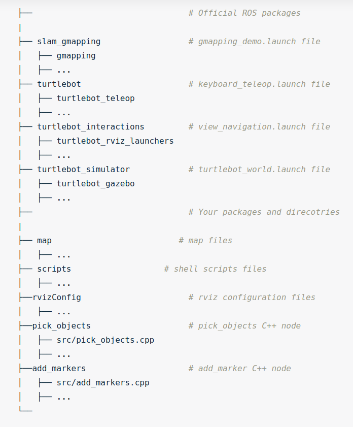

# Home Service Robot: Path Planning

### Dependencies

* [ROS Kinetic](http://wiki.ros.org/kinetic)
* [Gazebo for ROS Kinetic](http://gazebosim.org/tutorials?tut=ros_installing&cat=connect_ros)
* [slam_gmapping](https://github.com/ros-perception/slam_gmapping)
	1. `cd PATH_TO/Home_Service_Robot/src`
	2. `git clone https://github.com/ros-perception/slam_gmapping`
	3. `sudo apt-get install ros-kinetic-openslam-gmapping`
	4. `cd ..`
	5. `catkin_make`
* [ros-teleop](https://github.com/turtlebot/turtlebot):
	1. `cd PATH_TO/Home_Service_Robot/src`
	2. `git clone https://github.com/ros-teleop/teleop_twist_keyboard`
	3. `sudo apt-get install ros-kinetic-turtlebot-teleop`
	4. `cd ..`
	5. `catkin_make`
* [turtlebot_interactions](https://github.com/turtlebot/turtlebot_interactions):
	1. `cd PATH_TO/Home_Service_Robot/src`
	2. `git clone https://github.com/turtlebot/turtlebot_interactions.git`
	3. `cd ..`
	4. `catkin_make`
* [turtlebot_gazebo](https://github.com/turtlebot/turtlebot_simulator):
	1. `cd PATH_TO/Home_Service_Robot/src`
	2. `git clone https://github.com/turtlebot/turtlebot_simulator.git`
	3. `cd ..`
	4. `catkin_make`

### Overview

The packages used in this project were:
1. turtlebot_gazebo: Used to load the world the turtlebot gazebo world. Also used to localize using amcl after mapping an area.
2. turtlebot_rviz_launchers: to load the rviz and it's configurations.
3. turtlebot_teleop: to control the robot manually with keyboard keys. Useful for testing and mapping.
4. gmapping: mapping the envioronment gazebo world.
5. pick_objects: to control the robot to the pick up and drop off destinations.
6. add_markers: to simulate the objects being picked up or dropped off.

#### Goal
The goal of this project was to have a robot drive to a pick up location where a package (green box) would be waiting to be picked up. The box would then disapear to simulate a pick up and then the robot would move to a predefined drop off location where the green box would re-apear.

### How to run it
 
TO_DO:
1. Clone this repo: `git clone https://github.com/martinezedwin/Home_Service_Robot.git`
2. Clone and install the ROS repos outlined in the dependencies.
3. `cd PATH_TO/Home_Service_Robot/` and then `catkin_make`.
4. `cd PATH_TO/Home_Service_Robot/src/scripts`
5. Run the home_service script: `./home_service.sh`

### Results

