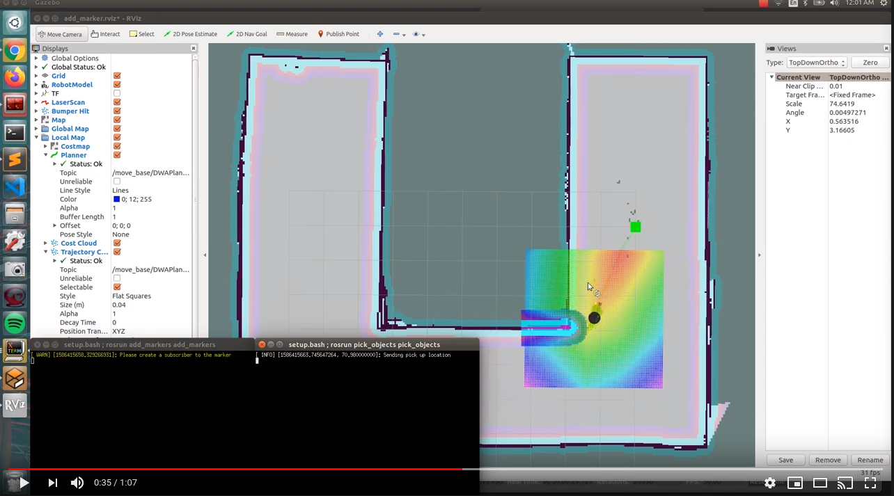

# Home Service Robot: Path Planning

### Dependencies

* [ROS Kinetic](http://wiki.ros.org/kinetic)
* [Gazebo for ROS Kinetic](http://gazebosim.org/tutorials?tut=ros_installing&cat=connect_ros)
* [slam_gmapping](https://github.com/ros-perception/slam_gmapping)
	1. `cd PATH_TO/Home_Service_Robot/src`
	2. `git clone https://github.com/ros-perception/slam_gmapping`
	3. `sudo apt-get install ros-kinetic-openslam-gmapping`
	4. `cd ..`
	5. `catkin_make`
* [ros-teleop](https://github.com/turtlebot/turtlebot):
	1. `cd PATH_TO/Home_Service_Robot/src`
	2. `git clone https://github.com/ros-teleop/teleop_twist_keyboard`
	3. `sudo apt-get install ros-kinetic-turtlebot-teleop`
	4. `cd ..`
	5. `catkin_make`
* [turtlebot_interactions](https://github.com/turtlebot/turtlebot_interactions):
	1. `cd PATH_TO/Home_Service_Robot/src`
	2. `git clone https://github.com/turtlebot/turtlebot_interactions.git`
	3. `cd ..`
	4. `catkin_make`
* [turtlebot_gazebo](https://github.com/turtlebot/turtlebot_simulator):
	1. `cd PATH_TO/Home_Service_Robot/src`
	2. `git clone https://github.com/turtlebot/turtlebot_simulator.git`
	3. `cd ..`
	4. `catkin_make`

### Overview
TO_DO:

#### Goal
TO_DO:

### How to run it
 
TO_DO:
1. Clone this repo: `git clone https://github.com/martinezedwin/Go_Chase_It`
2. Install ROS and Gazebo (from the project directory `chmod +x setup.sh && ./setup.sh`)
3. Install ros-teleop (see commands under Dependencies)
4. run the run_world_1.sh script: `chmod + x run_world_1.sh && ./run_world.sh`. 
5. run the get ball script to have the robot look for and chase the ball: `chmod + x amcl_2.sh && ./amcl_2.sh`
6. Control the bot: `chmod + x teleop_3.sh && ./teleop_3.sh`

### Results
TO_DO:
Once the project is running you will see an unlocalized robot in Rviz:

Note: The arrows are scattered

After moving for a bit, the robot quickly localizes:

|   Top View            |    Side View      |
|---------------|----------|
|| |

Note: How the arrows converged

